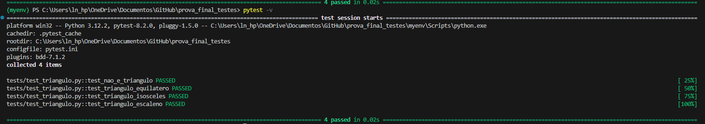
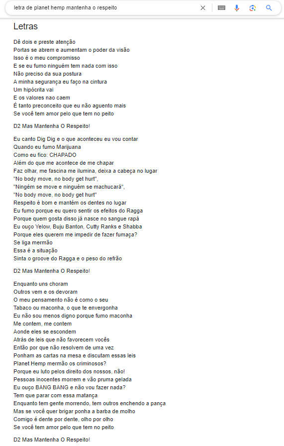
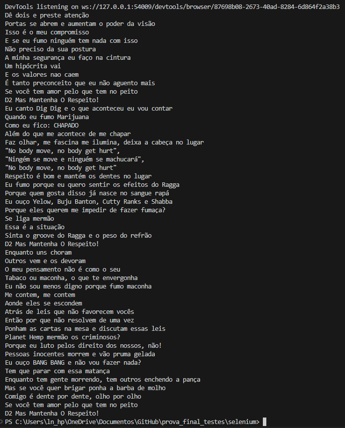
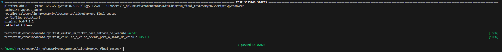

# Prova_Final_Testes

Repositorio com finalidade de desenvolver a prova\
final da materia de Automacao de Testes de Software

alunos: Alan Harenza Pereira - RA: 2201070\
        Pamela Jesus Lima - RA: 2201515

Bibliotecas usadas
* pytest
* pytest-bdd
* selenium
* webdriver manager
* datetime

Atividade 1\

Atividade 2\

Atividade 3\
